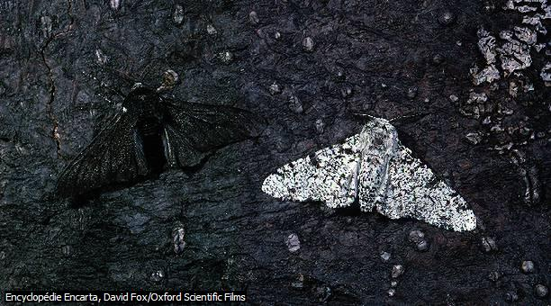
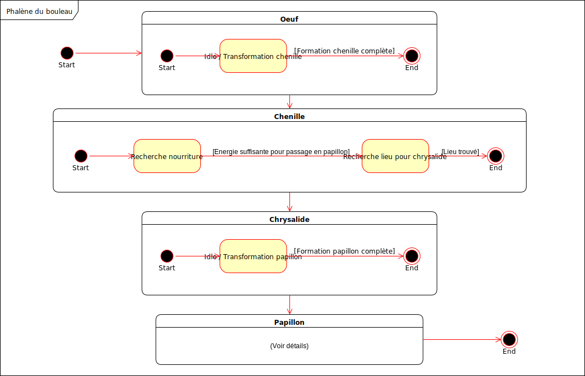
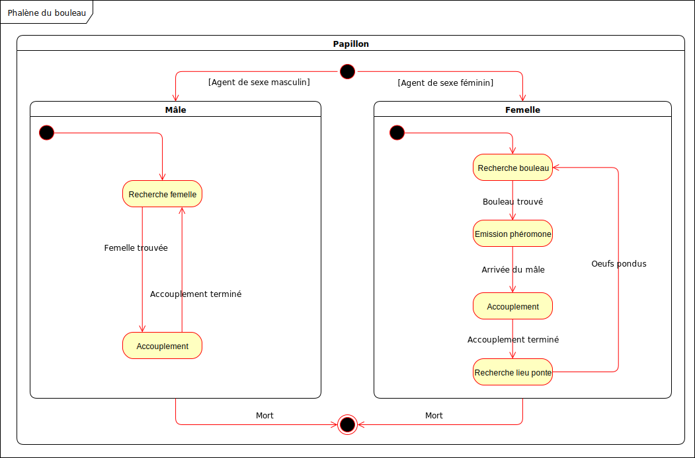

# HMIN321 - Société Virtuelle : Cahier des charges

Réalisé par Odorico Thibault et Calvet Nicolas

[TOC]

## Dérive génétique et sélection naturelle : Le Phalène du Bouleau

Notre projet s'intéressera au mécanismes de **dérive génétique** et de **sélection naturelle** et tentera de les appliquer dans le cadre d'un système multi-agent. 

Tout particulièrement nous essaieront de répondre au problématiques suivantes :

- Comment peut-on adapter les mécanisme à la base de la spéciation dans un système multi-agents ?
- Comment un tel système évoluera en modifiant ses paramètres ?

Nous tenteront de répondre à ces questions en simulant un cas concret, en l’occurrence la spéciation chez le Phalène du bouleau. Nous voulons que notre simulation dispose de paramètres variés nous permettant de générer un grande variétés de situation, notamment sur les points suivants :

- **Les Phalènes**
  - *Caractéristiques*
    - Couleur
      - Œuf
      - Larve
      - Chrysalide
      - Papillon Male
      - Papillon Femelle
    - Sexe
    - Phéromones femelle (Propagation sous forme de gradient)
    - Reproduction
      - Brassage génétique
      - Mutations
- **Les prédateurs : Oiseaux**
  - *Caractéristiques*
    - Perception
      - Distance
      - Taux perception en fonction de la couleur du papillon sur son patch

- **L'environnement**
  - *Éléments*
    - Forets : Nuance de verts
    - Bouleaux : Icône d'arbre en nuance de gris (dépend du niveau de pollution)
    - Usines : Icône d'usine (influant sur la couleur des patches voisins)
  - *Modificateurs*
    - Usine
      - Taux création usines

## FSM : Cycle de vie du Phalène de bouleau

## FSM : Reproduction du Phalène du Bouleau

## Choix de l'environnement de développement

Notre projet sera donc une simulation. De ce fait nous avons choisis NetLogo pour le développer car nous le maîtrisons de part nos précédents cours à ce sujet (et notamment parce qu'on a déjà programmé des mécanismes que nous pouvons réutiliser) mais aussi, et surtout, pour son côté pratique pour paramétrer, monitorer et implémenter les comportements sous forme de machine à états.

