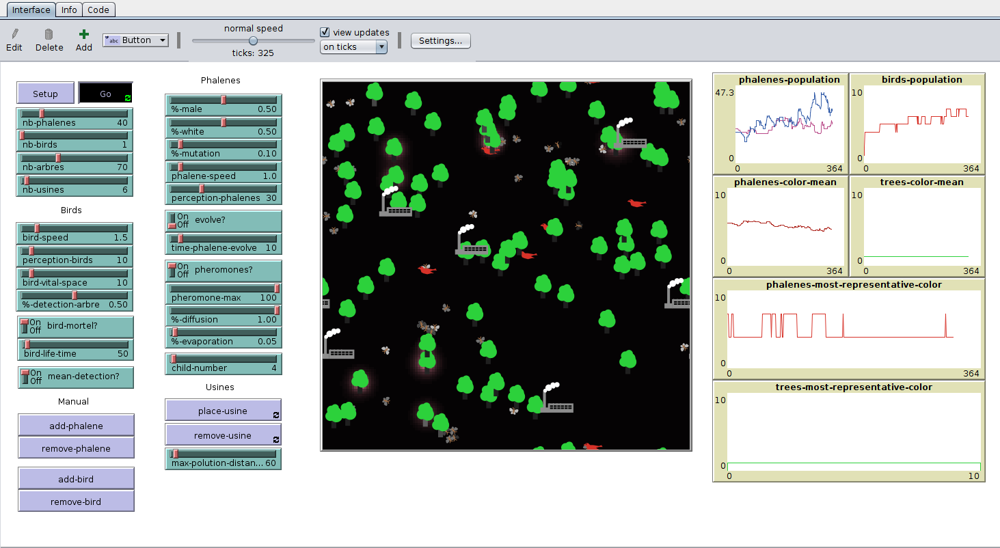

# Phalène du Bouleau

Simulation du cycle de vie de la Phalène du Bouleau pour mettre en évidence l'influence de la sélection naturelle sur la couleur du Phalène (pollution, couleur des arbres, prédateurs...).

